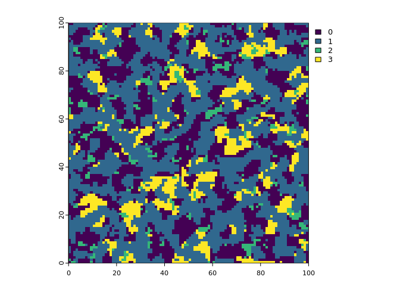
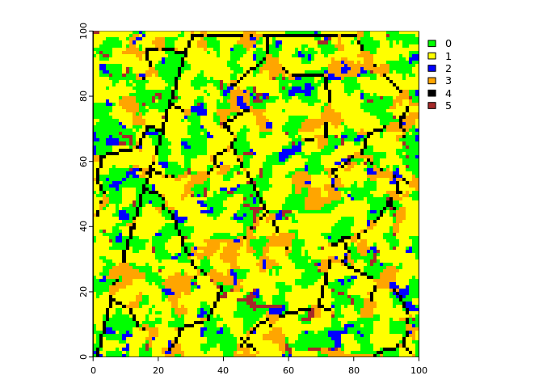

<!-- README.md is generated from README.Rmd. Please edit that file -->

# landsimR

<!-- badges: start -->
<!-- badges: end -->

The package landsimR aims to create virtual landscapes …

## Installation

You can install the development version of landsimR using devtools:

``` r
devtools::install_github('m-kucera/landsimR')
```

## Basic Virtual Landscape Creation

``` r
library(landsimR)
set.seed(1)
landscape <- create_landscape(c(100, 100), c(.1, .1, .05), c(.5, .1, .3))
```

Plot of `landscape`:


Adding line features to `landscape`:

``` r
landscape2 <- add_lines(landscape, c(1, .025), c(F, .025), c(3, 0))
#> Warning in
#> st_cast.sf(dplyr::filter(sf::st_as_sf(terra::as.polygons(terra::rast(binary_matrix))),
#> : repeating attributes for all sub-geometries for which they may not be
#> constant
plot(rast(landscape2), col = c('green', 'yellow', 'blue', 'orange', 'black', 'brown'))
```


