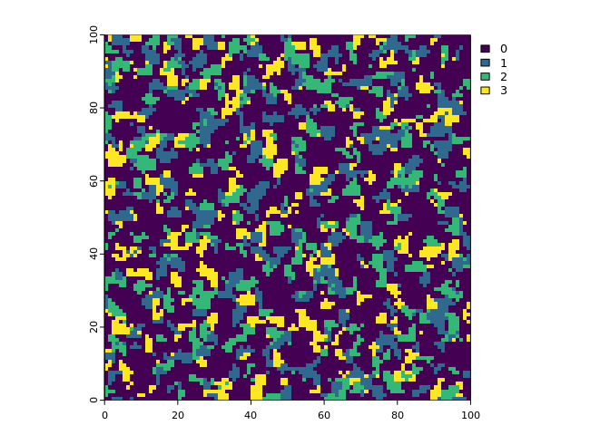

<!-- README.md is generated from README.Rmd. Please edit that file -->

# landsimR

<!-- badges: start -->
<!-- badges: end -->

The goal of landsimR is to allow simple yet …

## Installation

You can install the development version of landsimR like so:

``` r
install_github('')
```

## Basic Virtual Landscape Creation

``` r
library(landsimR)
landscape = create_landscape()
```

You’ll still need to render `README.Rmd` regularly, to keep `README.md`
up-to-date. `devtools::build_readme()` is handy for this.

Plot of `landscape`:



In that case, don’t forget to commit and push the resulting figure
files, so they display on GitHub and CRAN.
