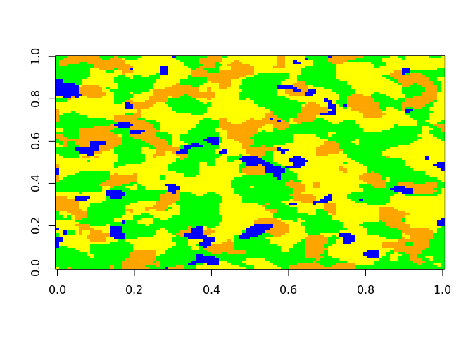
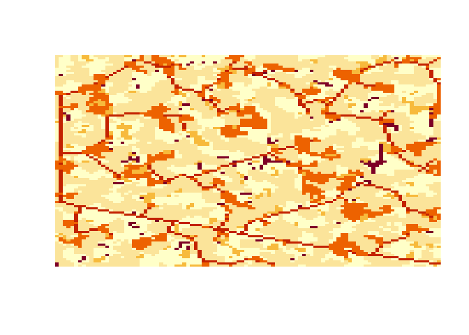
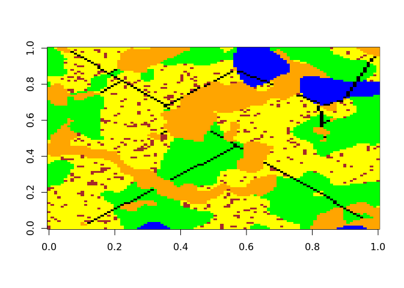
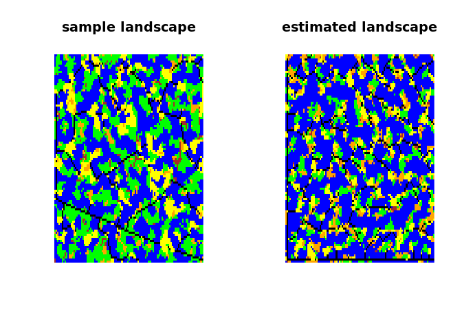
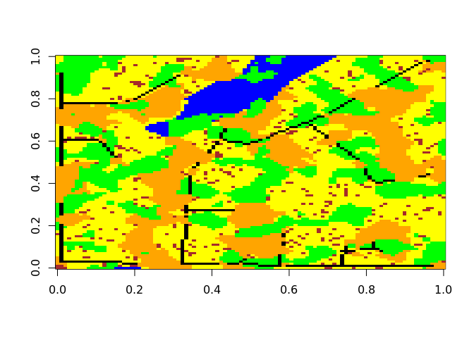
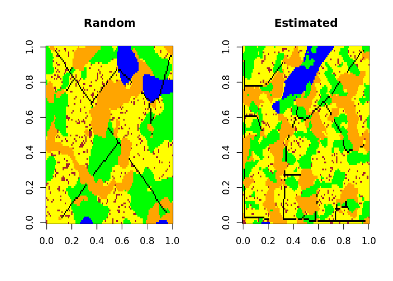

<!-- README.md is generated from README.Rmd. Please edit that file -->

# landsimR

<!-- badges: start -->
<!-- badges: end -->

The package `landsimR` aims to create virtual landscapes …

The package is in development …

## Installation:

You can install the development version of `landsimR` using devtools:

``` r
# install.packages('devtools')
library(devtools)
devtools::install_github('m-kucera/landsimR')
```

## Basic Virtual Landscape Creation:

Create polygon (patch) `landscape` using `create_landscape()`

``` r
library(landsimR)

set.seed(1)
landscape <- create_landscape(
  dim = c(100, 100),
  f = c(.05, .05, .05),
  q = c(.05, .2, .5)
  )

colors <- c('green', 'blue', 'orange', 'yellow', 'black', 'brown')

image(landscape, col = colors[1:4])
```



Add line features to `landscape` with `add_lines()`

``` r
landscape <- add_lines(
  landscape,
  f = c(1, .025),
  q = c(F, .025),
  overlap = c(2, 3)
  )

image(landscape, col = colors)
```


Convert `landscape` to `LandscapeObj` class

``` r
landscape <- LandscapeObj(
  landscape,
  classType = c(1,1,1,1,2,3)
  )

class(landscape)
#> [1] "LandscapeObj"
#> attr(,"package")
#> [1] "landsimR"
```

View `LandscapeObj`

``` r
landscape
#> LandscapeObj 
#>  landscape:  matrix array  dim: 100 100 
#>      class:  0 1 2 3 4 5 
#>  classType:  1 1 1 1 2 3
```

View the structure of `LandscapeObj`

``` r
str(landscape)
#> Formal class 'LandscapeObj' [package "landsimR"] with 3 slots
#>   ..@ landscape: num [1:100, 1:100] 5 0 0 2 0 0 0 0 0 0 ...
#>   ..@ classes  : chr [1:6] "0" "1" "2" "3" ...
#>   ..@ classType: num [1:6] 1 1 1 1 2 3
```

Use generic `plot()` function for `LandscapeObj`

``` r
plot(landscape, col = colors)
```



## Randomization:

Use parameter randomization to create a random landscape

``` r
set.seed(0)

random_parameters <- list(
  poly = list(
  f = c(runif(1, 0.005, .01),
        runif(1, .001, .1),
        runif(1, .005, .05)
        ),
  q = c(runif(1, 0, .1),
        runif(1, 0.05, .25),
        runif(1, 0.5, .9)
        )
  ),
  line = list(
    f = c(1, runif(1, .025, .1)),
    q = c(F, .05)
  )
  )

random_landscape <- create_landscape(
  dim = c(100, 100),
  f = random_parameters$poly$f,
  q = random_parameters$poly$q
  )

random_landscape <- random_landscape |> 
  add_lines(
    random_parameters$line$f,
    random_parameters$line$q,
    overlap = c(2, 3)
    )

image(random_landscape, col = colors)
```



## Parameter estimation:

Estimate the input parameters of the random landscape using
`estimate_parameters()` function. The first (pink) class of
`estimated_landscape` is leftover cells

``` r
estimated_parameters <- estimate_parameters(
  landscape = random_landscape,
  curve = 5,
  line = 4
  )

estimated_landscape <- create_landscape(
  dim = c(100, 100),
  # f = parameters$poly$f[2:4],
  # q = parameters$poly$q[2:4]
  f = estimated_parameters$poly$f,
  q = estimated_parameters$poly$q
  ) 

estimated_landscape <- estimated_landscape |>
  add_lines(
    f = (estimated_parameters$line$f),
    q = (estimated_parameters$line$q),
    # overlap = c(2, 3)
    overlap = c(3, 4)
    )

# par(mfrow = c(1, 2))
# plot(random_landscape, col = c('green', 'blue', 'orange', 'yellow', 'black', 'brown'), axes = F, main = 'sample landscape')

image(estimated_landscape, col = c('pink', colors))
```



Random parameters and estimation

| Parameter |  Random   | Estimated | Difference (abs) |
|:---------:|:---------:|:---------:|:----------------:|
|  poly.f1  | 0.0094835 | 0.0085986 |    0.0008849     |
|  poly.f2  | 0.0272854 | 0.0338074 |    0.0065220     |
|  poly.f3  | 0.0217456 | 0.0607316 |    0.0389861     |
|  poly.q1  | 0.0572853 | 0.0627338 |    0.0054485     |
|  poly.q2  | 0.2316416 | 0.2947126 |    0.0630711     |
|  poly.q3  | 0.5806728 | 0.7054134 |    0.1247406     |
|  line.f1  | 1.0000000 | 1.0000000 |    0.0000000     |
|  line.f2  | 0.0923792 | 0.1573066 |    0.0649274     |
|  line.q1  | 0.0000000 | 0.0000000 |    0.0000000     |
|  line.q2  | 0.0500000 | 0.0526139 |    0.0026139     |

Replace the leftover cells with the most common value around the cell

``` r
load_all('~/landsimR/')

estimated_landscape <- estimated_landscape |>
  poly_landscape(c(1:max(estimated_landscape)), not = 5)

image(estimated_landscape, col = colors)
```



Side by side comparison of random and estimated

``` r
par(mfrow = c(1, 2))
image(random_landscape, col = colors, main = 'Random')
image(estimated_landscape, col = colors, main = 'Estimated')
```



<!-- use devtools::build_readme() -->
