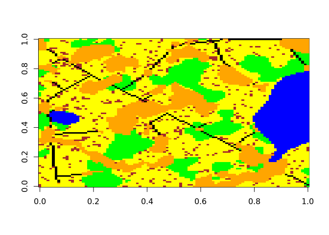
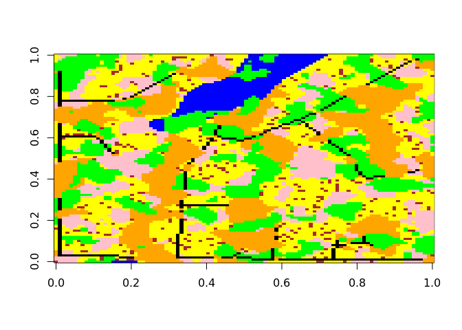

<!-- README.md is generated from README.Rmd. Please edit that file -->

# landsimR

<!-- badges: start -->
<!-- badges: end -->

The package landsimR aims to create virtual landscapes …

## Installation

You can install the development version of landsimR using devtools:

``` r
library(devtools)
install_github('m-kucera/landsimR')
```

## Basic Virtual Landscape Creation

``` r
library(landsimR)
set.seed(1)
landscape <- create_landscape(c(100, 100), c(.1, .1, .05), c(.5, .1, .3))
```

Adding line features to `landscape`:

``` r
landscape <- add_lines(landscape, c(1, .025), c(F, .025), c(3, 0))
```

Plot the `landscape` using `image()`

``` r
image(landscape, axes = F)
```


Convert `landscape` to `LandscapeObj` class

``` r
landscape <- LandscapeObj(landscape, c(1,1,1,1,2,3))

class(landscape)
#> [1] "LandscapeObj"
#> attr(,"package")
#> [1] "landsimR"
```

View the structure of `landscape`

``` r
str(landscape)
#> Formal class 'LandscapeObj' [package "landsimR"] with 3 slots
#>   ..@ landscape: num [1:100, 1:100] 5 1 1 1 1 0 1 0 1 1 ...
#>   ..@ classes  : chr [1:6] "0" "1" "2" "3" ...
#>   ..@ classType: num [1:6] 1 1 1 1 2 3
```

Use generic `plot()` function for `LandscapeObj`

``` r
plot(landscape, axes = F)
```


Random parameter `landscape`

``` r
set.seed(0)
random_landscape <- create_landscape(c(100, 100), c(runif(1, 0.005, .01), runif(1, .001, .1), runif(1, .005, .05)), c(runif(1, 0, .1), runif(1, 0.05, .25), runif(1, 0.5, .9))) |> 
  add_lines(c(1, runif(1, .025, .1)), c(F, .05), c(2, 3))
#> Warning in
#> st_cast.sf(dplyr::filter(sf::st_as_sf(terra::as.polygons(terra::rast(binary_matrix))),
#> : repeating attributes for all sub-geometries for which they may not be
#> constant
```

Plot the random landscape using `image()`

``` r
image(random_landscape, col = c('green', 'blue', 'orange', 'yellow', 'black', 'brown'), axes = F)
```



Estimate the input parameters of `landscape`

``` r
parameters <- estimate_parameters(landsimR::landscape, 5, 4)

estimated_landscape <- create_landscape(c(100, 100), parameters$poly$f[2:4], parameters$poly$q[2:4]) |>
  add_lines((parameters$line$f), (parameters$line$q), c(3, 2)) |>
  LandscapeObj(c(1,1,1,1,2,3))

par(mfrow = c(1, 2))
plot(landscape, col = c('green', 'blue', 'orange', 'yellow', 'black', 'brown'), axes = F, main = 'sample landscape')
plot(estimated_landscape, col = c('green', 'blue', 'orange', 'yellow', 'black', 'brown'), axes = F, main = 'estimated landscape')
```



use `build_readme()`
